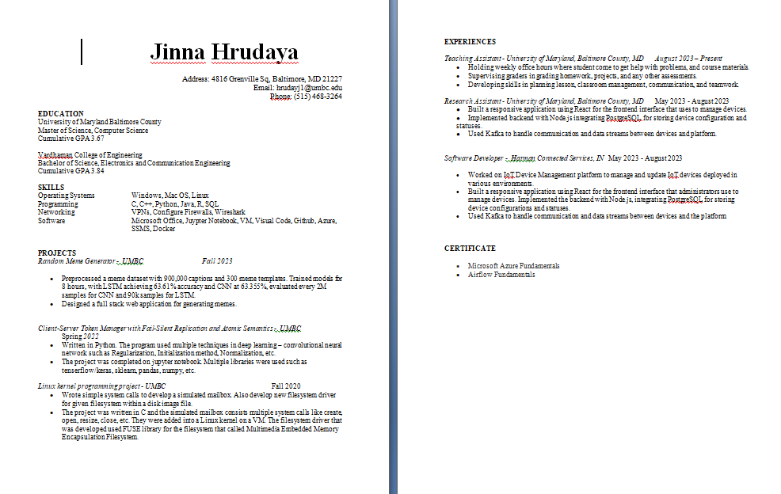

# Project Title: LinkedGuard: Safeguarding LinkedIn Privacy by Identifying Authentic Companies, and Scraping Resumes Accordingly

## Description
LinkedGuard is a project designed to enhance privacy and security for LinkedIn users by leveraging machine learning algorithms to assess the legitimacy of companies and tailor resume scraping based on assessed risk levels. LinkedGuard acts as a protective shield, allowing users to share their resume information selectively based on the legitimacy of the company they are applying to.

## Why did we build this project?
The primary motivation behind LinkedGuard is to mitigate the risks posed by fraudulent companies on LinkedIn. These companies often use job listings to extract personal information from applicants' resumes, which can lead to privacy breaches and potential misuse of sensitive data. With many companies posing as frauds on LinkedIn job listings, our goal is to protect your privacy from the personal information you share on your resume.

## What problems does it solve?
LinkedGuard addresses the following key problems:
- **Fraudulent Companies:** Identifies and flags potentially fraudulent companies on LinkedIn.
- **Privacy Protection:** Safeguards users' personal information by automatically masking sensitive details in resumes for high-risk companies.
- **Efficiency:** Streamlines the job application process by automating resume customization based on company legitimacy.

## Features
- **Company Legitimacy Assessment:** Utilizes machine learning (TensorFlow, PyTorch) to classify companies as legitimate or risky based on historical data and job listing analysis.
- **Resume Scraper:** Automates the extraction and modification of resume content (address, phone, email, education, projects, experiences) based on the assessed risk level of the company.
- **Privacy Enhancement:** Ensures that users can apply to jobs confidently without compromising their personal information to potentially fraudulent entities.

*Original Resume*

*Resume with Risk Level 1*

*Resume with Risk Level 5*
## How to use
1. Fork the repository.
2. Run the provided files.

## Technologies
- **Python:** Used for its versatility and extensive libraries that facilitate web scraping, text processing, and automation tasks.
- **docx2txt library:** Enabled conversion of resumes from docx format to plain text, simplifying data extraction and manipulation.
- **Spacy:** Applied for NLP tasks to locate names and emails within resumes, despite its general web text training.
- **Regular Expressions (Regex):** Utilized to accurately identify and extract specific patterns like addresses and phone numbers from resume texts.
- **Machine Learning (ML):** Employed to classify companies as legitimate or fake based on features from a dataset, determining associated risk levels.
- **docx library:** Used for generating new resumes in docx format after masking sensitive information based on ML-derived risk levels.
- **Keyword search:** Implemented to locate and process sections such as Education, Skills, Projects, Experiences, and Certificates within resumes for structured data handling.
- **Data Analysis:** Conducted to identify key features related to company legitimacy and validate ML model performance.
- **Survey Tools:** Utilized for gathering qualitative and quantitative data from participants to refine features and validate model outcomes.
- **Git:** Employed for version control to manage project codebase, track changes, and facilitate collaborative development.
- **Jupyter Notebook:** Possibly used for interactive data exploration, model development, and documentation due to its ease of code execution and visualization integration.

## Collaborators
- Hrudaya Jinna
- Kiran Reddy
- Aydin Ayanzadeh
- An Tran
